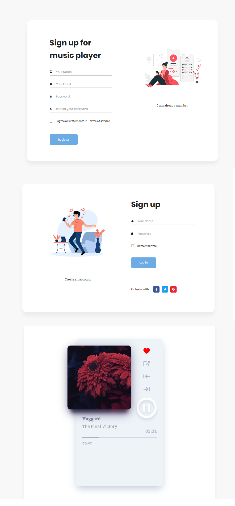

# simple-musicplayer
<h1>simple music player</h1>

This is an simple  music web was made by using php , mysql and bootstrap.

<h1>how to connect database</h1>

the sql for database is put in phpmyadmin to create mysqlie database to saved users accounts
and update informations in config file put your username and password and name of database you was created

<h1>how to listen</h1>

to connect the home page to play some music section, run your xampp or whatever you use and go to http://localhost/simple-musicplayer/ and registration new account and he redired you to home page
Finally you can listen to some music

